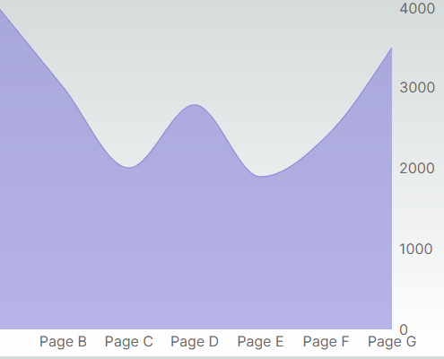

# Rechart 라이브러리 연습
공식문서를 참고해서 만들었습니다.

## 연습 내용
- 여러 차트 적용할 폴더구조와 파일생성
- 공식문서에서 제공한 코드 파일에 적용
- 가져온 차트에서 이미 정의된 CSS를 수정하여 원하는 스타일로 변경
- 새로운 스타일 추가하기 위해 코드 추가 삽입
- 변경 및 추가 하면서 나온 에서 수정

## 개발 환경
- "recharts": "^2.12.7"
- "14.2.4",

## 예시 이미지

